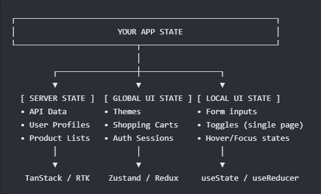

# New React Project Setup Checklist

## 1. Initial Environment Setup

1.1 [ ] If you haven't already, create a blank repo on Github, clone it, and add a root-level `.gitignore`.
1.2 [ ] add separate `frontend/` and `backend/` subfolders (if you haven't already lol) inside this single repo. You can then CD into your
frontend dir to do the following steps.
1.3 [ ] Scaffold the Vite + TypeScript Template: Run `npm create vite@latest . -- --template react-ts` in the terminal.
1.4 [ ] Configure your code consistency tools (ESLint and Prettier):

- Run `npm install -D prettier eslint-config-prettier eslint-plugin-prettier`
- Create a `.prettierrc` file in the root folder to set your rules. For example:

```{"semi": true, "singleQuote": true}

```

- Link Prettier to ESLInt inside your .eslintrc.cjs config file so formatting errors show up directly as linting warnings.
  1.5 [ ] Create a configuration BluePrint (.evn.example):
- Create a blank file named exactly `.env.example` in your root folder. We make this to document, on github, what keys our app needs to operating without exposing our real secrets (which sit in `.env` and never gets pushed to github, EVER)
- Add placeholder names for any external keys your app will eventually need. For vite, they must start with `VITE_`. Here's an example:

```VITE_API_URL=https://example.com
VITE_FIREBASE_KEY=your_key_here
```

- Create your real, secret `.env` file containing your actually personal API keys, and double check that `.env` is listed inside your `.gitignore` file. This is **SUPPERRRRRRR** important because we can't be uploading our secrets to github or they aren't secret anymore! hahaha. Oh, and if you can, look into and try to use sandbox keys during development (in your `.env`) instead of production keys so you have another level of security.
  1.6 [ ] Add a Clean Directory Structure Blueprint
- Wipe out the default Vite placeholder boilerplate styles inside `src/App.css` and `src/index.css`
- Create your primary folder architecture inside the `src/` folder:

* `src/components/` For your... components :D The visual stuff!
* `src/hooks/` For your custom hooks! Or to be fancy, we can say "custom react logic loops"
* `src/services/` for backend API fetch operations
* `src/utils/` for pure helpers. Gotta make these pure functions.
* `src/assets/` for static files that your app uses like images, logos, fonts, and global CSS stylesheets (`main.css`)
* `src/context/` files for global state management using React Context, like `UserContext`
* `src/layouts/`
* `src/pages/`
* `App.jsx` this is the main root component
* `main.jsx` this is the entry point for React

## 2. Testing Setup

2.1 [ ] **Choose and setup your frontend test runner** (this is the environment that runs your automated assertions via your .test.js/.test.ts test files). For now, I'm going to use the standard trio of `vitest`, `jsdom`, and `React Testing Library`. Here's how to configure the trio:

1. Install dependencies: `npm install -D vitest jsdom @testing-library/react`
2. Add a test command to the script field of your **package.json**: `"test": "vitest"`
3. Configure the DOM link: Inside vite.config.js, tell vitest to use jsdom as the simulated browser environment -

```export default defineConfig({
   // ... all the other vite config stuff
   test: {
      environment: 'jsdom',
   },
})
```

2.2 [ ] **Configure your live UI testing server**: We'll be using vite, so call you gotta do is add this command to your scripts field in **package.json**: `"dev": "vite"` (If you're wondering why you don't have to specify an entrypoint, like with node.js, remember that vite mandates that you have to name the entrypoint `index.html` and put it in the root layer of your project so it perfectly resembles what real static hosts like Netflix and Vercel will be looking for when you deploy.)

Now, when you start developing, you just need to run `npm run dev` and `npm run test`

## 3. Architecture and Routing

- [ ] Organize the `src/` directory using a clear feature-module layout.
- [ ] Initialize navigation using React Router Data APIs (`createBrowserRouter`).
- [ ] Implement Route Loaders to prefetch critical server state before components render.
- [ ] Handle frontend form submissions and data mutations via Route Actions.

## 4. Resilience and UX Essentials

- [ ] Design and implement explicit loading states or skeleton screens for asynchronous operations.
- [ ] Wrap route components in Error Boundaries to capture and handle API failures gracefully.
- [ ] Enforce strict TypeScript typing across all components, avoiding the use of `any`.

# Other Stuff To Consider

## State

Here's an overview of how to delegate the way you manage state:


Also try to use a mix of these:

1. Storage Providers (they create and hold state)
   useState: Best for simple, localized state (e.g., toggling a modal).
   useReducer: Best for complex local state with multiple moving parts or complex business logic.
2. The Delivery Mechanisms (Pass Data Only)
   These are not state containers. They are architectural patterns used to move data from point A to point B.
   Prop Drilling: Passing data explicitly down through every layer of the tree.
   Composition: Passing components as props (like children). This completely avoids drilling by letting you instantiate the child right where the state lives.
3. The Hybrid Systems (Store and Deliver Globally)
   These systems do both: they hold the data in a central place and provide a built-in mechanism to broadcast that data to any component, bypassing the intermediate tree.
   useContext: Built into React. It broadcasts a useState or useReducer value to an entire sub-tree.
   useOutletContext: Built into React Router. It acts exactly like useContext, but specifically delivers state from a parent route down to its child route layout.
   Zustand & Redux: External global stores. They hold state completely outside of the React component tree and use optimized subscription systems to deliver data directly to any component that asks for it.
4. Server State Managers. These handle data fetched from an API.
   TanStack Query (React Query)
   RTK Query: (this is kinda like the answer from Redux to the creation of TanStack Query, at least to my understanding haha. Here's another way to put it that I read: "RTK Query wraps server state cache logic directly into the Redux ecosystem to match TanStack's capabilities")
   Route Loaders: Best for data needed exactly when a route changes (Just-In-Time server state).

In case you forget, here's a reminder to how you can think about designing your state handling system:

> I break state down into local UI state, global UI state, and server state. For local state, I use useState or useReducer for complex logic. To pass that data, I prefer component composition to keep things clean, but I'll use prop drilling if it's only going down one or two levels. For global UI state like themes, I use Zustand, and for server state, I rely on TanStack Query or Route Loaders to handle caching and avoid redundant network requests.

## Routing

1. Do you want to use standard client-side React Router v6, or the newer Remix/Vite/React router v7 file based router stuff? From my knowledge, React Router v6 is better for your current level (separate servers for front and backend, and therefore using client-side routing), and apparently React router v7 is more tailored towards SSR, so I suppose for Next.js. Long story short, just focus on React Router v6 for now.

## Hooks

1. Try to practice using useState, useReducer, useMemo, React.memo (or just use the modern syntax which is just 'memo') useCallback, useSubmit, useLoaderData, useParams, and others that you encounter to get a feel for them and when they could be useful.
